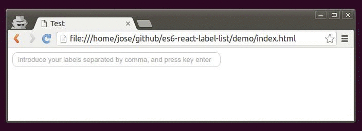

#React label/tag list component
[](https://www.npmjs.com/package/es6-react-label-list)

## Demo




## Dependencies

[React](http://facebook.github.io/react/)
[Less](http://lesscss.org/)

## Installation

```
$ npm install es6-react-label-list
```

## Usage

```js
import React from 'react';
import LabelList from 'es6-react-label-list/lib/label-list.js'

const MyAwesomeReactComponent = () => (
  <LabelList />
);

export default MyAwesomeReactComponent;
```

## Customization

Property | Type | Description
--- | --- | ---
`color` | String | font color of the label
`background` | String | background color of the label
`listUpdated` | Function | called any time there is an update of the label/tag list
`placeholder` | String | initial input text
`background` | Function | called any time user clicks on the label name


So far there are only these optional parameters for the component customization: *color*, to set the font color of the label; *background* , to set the background color of the label; *listUpdated*, a function is called any time there is an update of the label/tag list; *placeholder* as the initial input text; and *labelClicked*, a function is called any time user clicks on the label name.


```js
const printMyList = (list) => {
    console.log(list.join(', '))
}
const printLabel = (label) => {
    console.log(label)
}
const MyAwesomeReactComponent = () => (
    <LabelList
      color="black"
      background="green"
      listUpdated={printMyList}
      labelClicked={printLabel}
    />
);
```

## License

MIT

